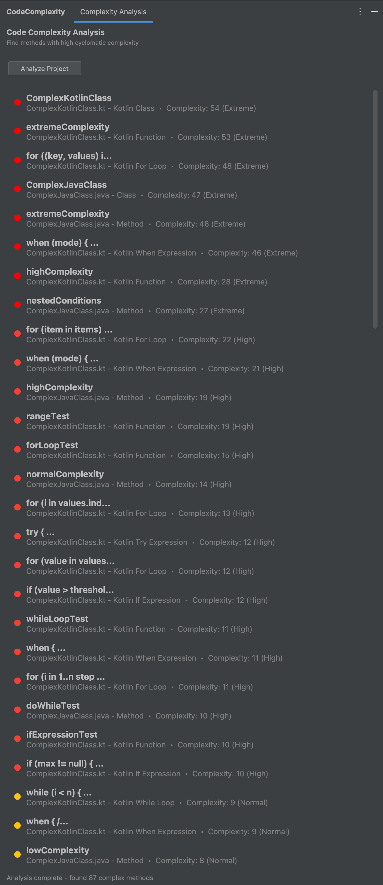
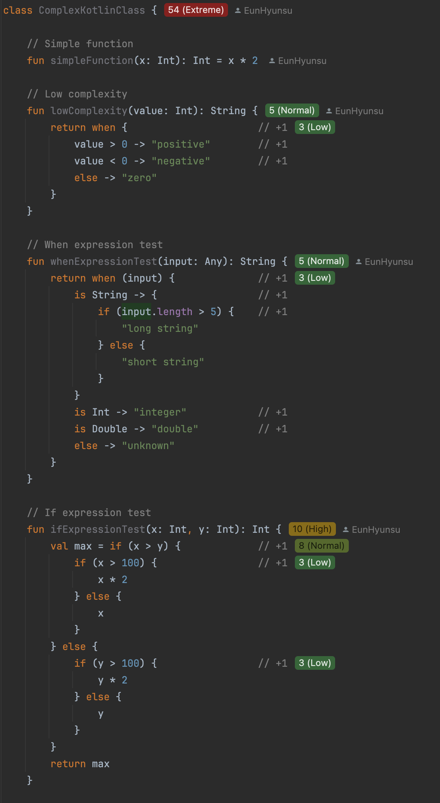

# CodeMetrics With Kotlin

[](https://plugins.jetbrains.com/plugin/28221-codemetrics-with-kotlin)
[](https://plugins.jetbrains.com/plugin/28221-codemetrics-with-kotlin)

<!-- Plugin description -->
Provides inlay indicators based on a customizable complexity calculation for **Java** and **Kotlin** files.

This plugin is based on the original [CodeMetrics](https://github.com/kisstkondoros/codemetrics-idea) by Tamas Kisst (MIT License) and has been extended to support **Kotlin** with updated UI compatibility for modern IntelliJ versions.

The plugin calculates cyclomatic complexity by parsing the AST and walking through each node, displaying scores inline with customizable thresholds and color coding.

## Features
- Real-time cyclomatic complexity calculation for **Java and Kotlin**
- Inline complexity hints in the editor with color-coded severity
- **AI-powered refactoring suggestions** via Claude, OpenAI, Gemini, or Codex (ChatGPT OAuth)
- **Project-wide complexity analysis** tool window with batch refactoring support
- **Refactoring diff viewer** with side-by-side comparison and one-click apply
- Customizable thresholds and colors with automatic validation
- Click on hints to see detailed breakdowns
- **Full Kotlin K2 compiler mode support**
- Supports classes, methods, control flow statements, properties, and lambda expressions
- **Granular Kotlin visibility controls** - toggle metrics for individual constructs (if, when, for, while, try, properties)
- **Specialized handling for Kotlin constructs** (Elvis operator, when expressions, etc.)
- Robust error handling with user-friendly validation messages

## Installation
- **Using IDE built-in plugin system**:
  <kbd>Settings/Preferences</kbd> > <kbd>Plugins</kbd> > <kbd>Marketplace</kbd> > <kbd>Search for "CodeMetrics With Kotlin"</kbd> > <kbd>Install</kbd>

## Configuration
<kbd>Settings/Preferences</kbd> > <kbd>Code Metrics With Kotlin</kbd> to customize:
- Complexity thresholds for different colors (low/normal/high/extreme)
- Which elements to measure (methods, classes, lambda expressions, properties)
- **Granular Kotlin visibility controls** (classes, functions, properties, lambdas, if/when/for/while/try)
- Calculation weights for different constructs
- **Kotlin-specific settings** (Elvis operator, when expressions)

**Note**: The plugin automatically validates configuration to prevent invalid threshold combinations.

### AI Refactoring Settings
<kbd>Settings/Preferences</kbd> > <kbd>Code Metrics With Kotlin</kbd> > <kbd>AI Refactoring</kbd> tab:
- **Provider**: Choose from Claude, OpenAI, Gemini, or Codex (ChatGPT OAuth login)
- **Credentials**:
  - Claude, OpenAI, and Gemini use API keys stored securely via IntelliJ PasswordSafe.
  - Codex uses ChatGPT OAuth login; stored OAuth tokens are kept in IntelliJ PasswordSafe.
    If browser automation is unavailable, the OAuth flow prompts for the callback URL.
- **Model**: Select model per provider (editable dropdown with current defaults)
  - Claude defaults to `claude-opus-4-7`; OpenAI defaults to `gpt-5.5`; Gemini defaults to `gemini-3-pro-preview`; Codex defaults to `gpt-5.3-codex`.
- **Custom Prompt**: Add custom instructions appended to the auto-generated prompt
- **Provider parameters**:
  - OpenAI / Codex reasoning effort: none / minimal / low / medium / high / xhigh (unsupported levels are omitted or normalized per selected model)
  - OpenAI text verbosity for GPT-5 models: low / medium / high
  - Claude effort: default / low / medium / high / xhigh / max
  - Gemini thinking level for Gemini 3 models: default / minimal / low / medium / high (Gemini 3 Pro sends low/high only; unsupported lower levels are normalized)

## Usage
1. **Inline Hints**: Complexity scores appear as inlay hints next to methods and classes
2. **Tool Window**: Access project-wide complexity analysis via <kbd>View</kbd> > <kbd>Tool Windows</kbd> > <kbd>CodeMetrics</kbd>
   - Sortable by complexity score
   - Click to navigate to code
   - **Suggest Refactoring** for single methods, **Batch Refactoring** for multiple
3. **AI Refactoring**: Right-click on a complexity hint > **Suggest AI Refactoring**, or use the lightbulb (Alt+Enter) on complex methods
4. **Interactive**: Click on any complexity hint to see detailed breakdown
5. **Configuration**: Fine-tune visibility, thresholds, and AI provider settings

## Supported Platforms
- **IntelliJ IDEA** 2024.3+
- **Kotlin K1 and K2** compiler modes
- **Java** and **Kotlin** languages

## Test Samples

The [`complexity-test-samples/`](complexity-test-samples/) directory is a standalone Gradle project with comprehensive test cases:

- **Java**: Simple to extreme complexity (1-25+), lambda expressions, anonymous classes, nested conditions
- **Kotlin**: when/if/for/while/try expressions, Elvis operator, properties, sealed classes

Open `complexity-test-samples` as a separate project in IntelliJ IDEA to test the plugin.

## Contributing

Contributions are welcome! Please see [CONTRIBUTING.md](CONTRIBUTING.md) for guidelines.

### For Contributors

**Prerequisites**:
- Java 17+ (required for building)
- Java 21 recommended for Gradle JVM to avoid validation warnings with newer JDK versions

**Quick start**:
```bash
git clone https://github.com/YOUR_USERNAME/codemetrics-idea.git
cd codemetrics-idea
./gradlew runIde
```

See [CONTRIBUTING.md](CONTRIBUTING.md) for full setup instructions and development tips.

## License
Licensed under the [MIT License](LICENSE).
<!-- Plugin description end -->

---

## Screenshots

<p align="center">
  
  
</p>

---

## Development

### Building from Source
```bash
./gradlew build
```

### Running in Development IDE
```bash
./gradlew runIde
```

### Publishing (Maintainers Only)
Maintainer release steps are tracked in [CONTRIBUTING.md](CONTRIBUTING.md#maintainer-release-process).
